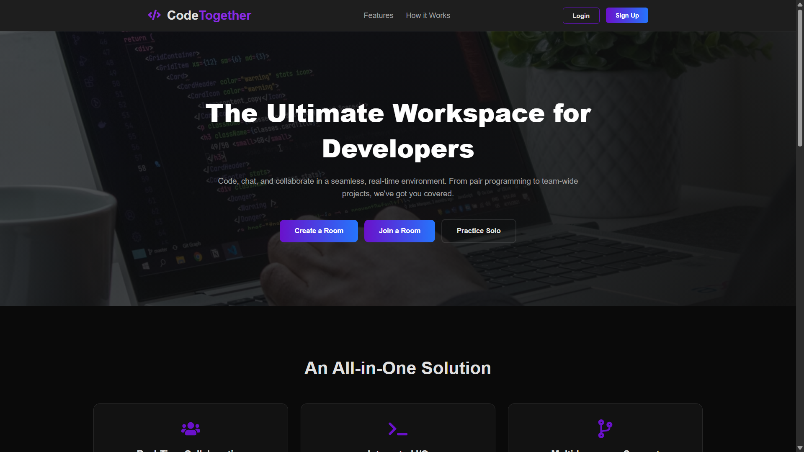
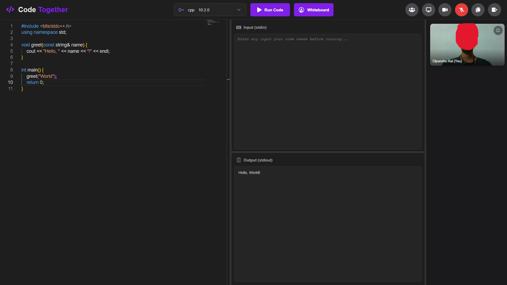
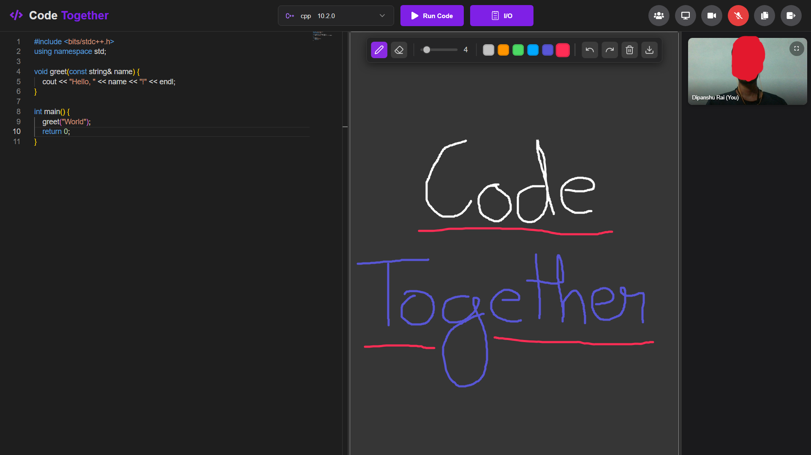
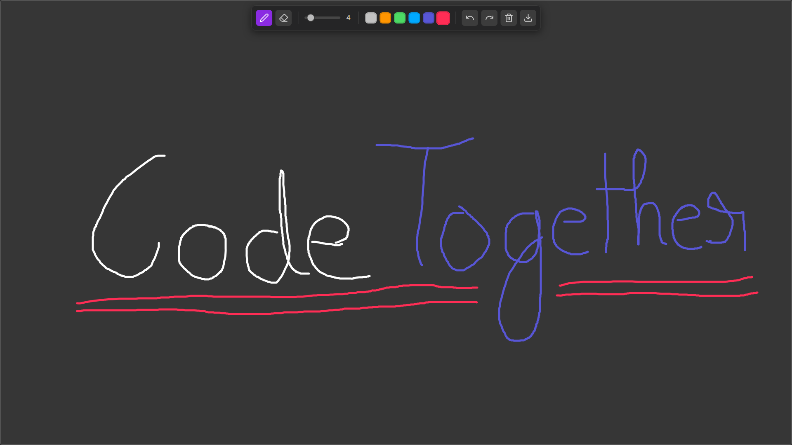

# CodeTogether - Real-Time Collaborative IDE

CodeTogether is a feature-rich, in-browser Integrated Development Environment (IDE) designed for seamless, real-time collaboration. It combines a powerful code editor, video and audio chat, screen sharing, and an interactive canvas into one cohesive platform, making it the ultimate workspace for pair programming, technical interviews, and team-based development.

### ✨ [Live project Link](https://code-together-seven.vercel.app/) 

---

## 📸 Screenshots

#### Homepage

#### Editor with I/O

#### Editor with Canvas

#### Canvas

## 🚀 Core Features

CodeTogether is packed with features to provide a comprehensive collaborative experience:

*   **👨‍💻 Real-Time Collaborative Code Editor:**
    *   Powered by **Monaco Editor**, the same editor that powers VS Code.
    *   Synchronized typing, selection, and scrolling.
    *   Support for multiple languages (`C`,`C++`, `Java`, `JavaScript`, `Python`, `TypeScript`, `C#`, `PHP`, `MySQL`).
    *   Customizable editor options (font size, minimap, etc.).

*   **▶️ Integrated Code Execution:**
    *   Run your code directly in the browser and see the output via the **Piston API**.
    *   Separate panes for providing standard input (stdin) and viewing output/errors (stdout/stderr).

*   **📹 Audio & Video Conferencing:**
    *   High-quality, low-latency video and audio calls powered by **WebRTC** and **Mediasoup**.
    *   Enable or disable your camera and microphone on the fly.

*   **🖥️ Screen Sharing:**
    *   Share your entire screen or a specific application window to guide your team.

*   **🎨 Canvas Support:**
    *   A digital canvas for brainstorming, system design, and visualization.
    *   Tools include a pen, eraser, color palette, and brush size controls.
    *   Undo/Redo functionality and the ability to download the whiteboard as a PNG.

*   **🚪 Secure, Room-Based Collaboration:**
    *   Create secure, private rooms with unique, shareable IDs.
    *   "Solo Mode" for individual practice without needing a room.
    *   Secure authentication with **JWT** and social login via **Google**.

## 🛠️ Tech Stack

This project is built with a modern, robust set of technologies for a scalable and real-time experience.

### Frontend

| Technology | Description |
| :--- | :--- |
| **[React.js](https://reactjs.org/)** | For building the user interface. |
| **[React Router](https://reactrouter.com/)**| For client-side routing. |
| **[Monaco Editor](https://microsoft.github.io/monaco-editor/)** | The core code editor component. |
| **[Socket.IO Client](https://socket.io/)** | For real-time WebSocket communication. |
| **[Y.js](https://yjs.dev/)** | A CRDT library for collaborative text editing. |
| **[Mediasoup Client](https://mediasoup.org/)** | For handling WebRTC transport and media streams. |
| **Plain CSS** | For styling the components. |

### Backend

| Technology | Description |
| :--- | :--- |
| **[Node.js](https://nodejs.org/) / [Express](https://expressjs.com/)** | For the signaling and API server. |
| **[Socket.IO Server](https://socket.io/)** | Manages WebSocket connections, room logic, and signaling. |
| **[Mediasoup Server](https://mediasoup.org/)** | A Selective Forwarding Unit (SFU) for scalable WebRTC conferences. |
| **[Piston API](https://github.com/engineer-man/piston)** | For secure, multi-language code execution. |
| **[MongoDB](https://www.mongodb.com/)** | Database for storing user profiles and authentication data. |
| **Authentication**| Secure sign-in/sign-up using **JSON Web Tokens (JWT)** and **Google OAuth 2.0**. |

## 🤝 Contributing

Contributions are what make the open-source community such an amazing place to learn, inspire, and create. Any contributions you make are **greatly appreciated**.

If you have a suggestion that would make this better, please fork the repo and create a pull request. You can also simply open an issue with the tag "enhancement".

1.  Fork the Project
2.  Create your Feature Branch (`git checkout -b feature/AmazingFeature`)
3.  Commit your Changes (`git commit -m 'Add some AmazingFeature'`)
4.  Push to the Branch (`git push origin feature/AmazingFeature`)
5.  Open a Pull Request

## 🙏 Acknowledgments

This project would not be possible without the incredible open-source libraries and tools that power it. Special thanks to:

*   [Microsoft](https://github.com/microsoft) for the Monaco Editor.
*   [The Y.js Team](https://github.com/yjs) for their amazing work on CRDTs.
*   [The Mediasoup Team](https://github.com/versatica) for making WebRTC scalable.

## 📬 Contact

Your Name: [dipanshurai933@gmail.com](mailto:dipanshurai933@gmail.com)

LinkedIn: [https://www.linkedin.com/in/dipanshu-rai-1b913025b](https://www.linkedin.com/in/dipanshu-rai-1b913025b)